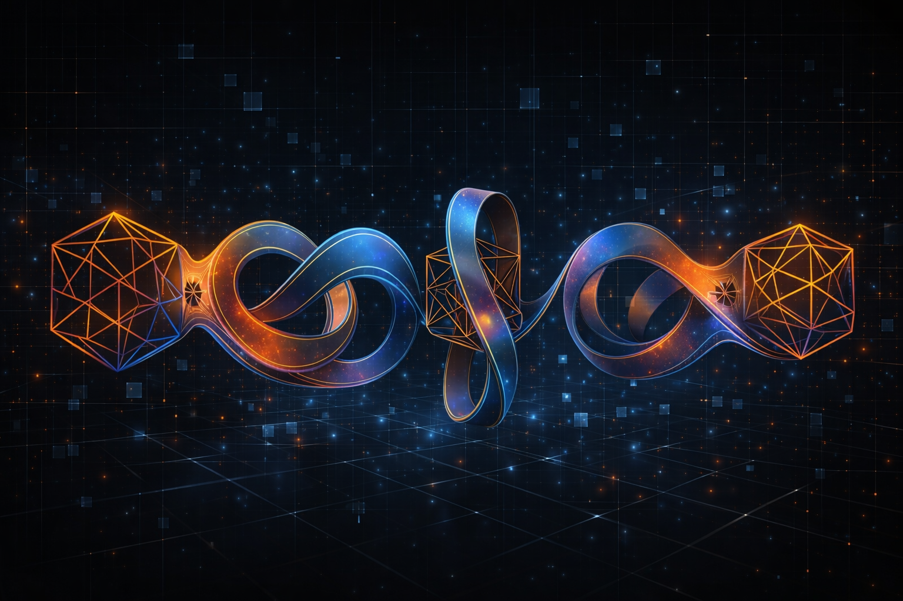

# TITANS Disposition

<p align="center">
  
</p>

**Persistent memory + self-improvement for AI coding agents.**

Your AI agents don't learn. Ours do. Here's how -- and the [math proving why](docs/research/INVERSE_REWARD_DESIGN.md) your current approach makes them worse.

```bash
pip install titans-disposition
```

---

## The Problem (Two of Them)

**Problem 1: Agents reset.** Every AI coding agent -- Claude Code, Copilot, Cursor -- starts fresh each session. Session 500 feels the same as session 1. Context injection (system prompts, RAG) addresses *knowledge*. Nothing addresses *disposition*: the accumulated sense of how to work with *you*.

**Problem 2: Naive self-improvement actively declines.** If you try to fix Problem 1 by scoring agent output and nudging weights toward deficits, you get *worse* over time. We proved this mathematically: deficit-chasing on a quality simplex with nonuniform proxy bias produces monotonic decline. The fix requires structural protocols, not continuous optimization. ([Full proof](docs/research/INVERSE_REWARD_DESIGN.md))

## Three Pillars

### 1. Disposition Engine

A gradient-gated M-vector that gives agents persistent taste.

Based on [Titans: Learning to Memorize at Test Time](https://arxiv.org/abs/2501.00663) (Google, 2025), but applied as a disposition accumulation system. Every prompt is classified, gated, and deposited into a weight matrix that evolves with your collaboration:

```python
from titans_disposition import DispositionEngine

engine = DispositionEngine(conversation_id="my-project")
engine.deposit("Add error handling to the auth module")   # routine: minimal weight
engine.deposit("No, use composition not inheritance")      # correction: punches through
engine.deposit("Redesign the pipeline as event-driven")    # architectural: carries momentum

metrics = engine.read()
print(f"M norm: {metrics['m_norm']:.4f}")  # The shape of your collaboration
```

The learning equation: `M_new = (1 - alpha) * M_old + theta * update + eta * momentum`

Three adaptive gates modulate every deposit:

| Gate | Symbol | Role | Correction | Routine |
|------|--------|------|------------|---------|
| **Forget** | alpha | Decay old disposition | 0.30 | 0.01 |
| **Learn** | theta | Absorb new signal | 0.07 | 0.005 |
| **Momentum** | eta | Maintain trajectory | 0.90 | 0.90 |

40 routine commits barely touch the M-vector. One correction reshapes it. Stability is guaranteed by [ISS Lyapunov bounds](docs/research/CONVERGENCE_PROOF.md) with a 464x safety margin.

### 2. Self-Improvement Loop

Observer/Analyst agents that compound learning across runs.

```
Observer -> Analyst -> Validator -> Librarian
 (score)   (patterns)  (regression)  (persist)
```

The loop scores agent output, extracts patterns, validates they don't regress other dimensions, and persists improvements. **Key insight from 18 cycles**: weight nudges fail for capability gaps. Structural protocols (binary: present or absent) succeed in O(1).

| Protocol | Effect on First Activation |
|----------|---------------------------|
| TriageProtocol | Exploration ratio 4.6x -> 1.13x |
| CitationProtocol | Citation accuracy 0/4 -> 5/5 |
| ProductionGuard | Zero violations across 3+ cycles |

Invoke with `/self-improvement` in Claude Code, or run the agents directly. See [Self-Improvement Guide](docs/SELF_IMPROVEMENT_GUIDE.md).

### 3. Prior Casting

Python class structures that reshape model priors through structural comprehension.

```python
class TriageProtocol:
    """Before researching, ask: does this require exploration?"""
    budget_ratio: float = 1.5  # max exploration / task-relevant ratio
    require_justification_above: float = 2.0
```

Models parse Python classes more reliably than prose instructions. A `dataclass` with typed fields and a docstring creates stronger behavioral constraints than a paragraph of instructions. Validated across 3 model families, 15 scenarios. See [Prior Casting Skill](.claude/skills/prior-casting/SKILL.md).

## 60-Second Quick Start

```bash
# Install
pip install titans-disposition

# Initialize storage
titans init

# Copy the Claude Code hook
cp .claude/hooks/titans_disposition.py ~/.claude/hooks/

# Add to ~/.claude/settings.json -> hooks.UserPromptSubmit
# (or run: titans init --claude-code)
```

Your agent now has persistent disposition. Every prompt accumulates into the M-vector. Corrections punch through. Run `/self-improvement` to start the capability loop.

See [Quick Start Guide](docs/QUICK_START.md) for detailed setup.

## How It Works

Every prompt passes through three stages:

**1. Classify** (< 1ms, regex, 8 domains):

| Domain | Example | Gate Profile |
|--------|---------|--------------|
| `routine` | "Add error handling" | Low theta, normal decay |
| `substrate_arch` | "Check the TITANS gradient norm" | High theta, strong momentum |
| `memory_arch` | "Run the FAISS pipeline" | Moderate theta |
| `identity` | "Adjust the persona carrier wave" | Low alpha (preserve) |
| `exploration` | "What's next on the roadmap?" | Low eta (less momentum) |
| + 3 more | voice_arch, meta_arch, pipeline_orch | Domain-specific |

Correction is orthogonal -- detected separately. Corrections always get boosted theta regardless of domain.

**2. Gate** -- Data-dependent gates (alpha, theta, eta) are computed from the embedding via learned projections, then modulated by domain priors.

**3. Accumulate** -- The gated gradient updates the M-vector. State persists to JSON. On next session load, the engine restores where you left off.

## The Settling Curve

Validated against thousands of real developer prompts across weeks of active development:

```
Day 1:  gn=0.047  ████████████████████████  (learning phase)
Day 2:  gn=0.028  ██████████████            (settling)
Day 3:  gn=0.032  ████████████████          (minor fluctuation)
Day 4:  gn=0.021  ██████████                (floor established)
Day 5+: gn=0.020  ██████████                (steady state)
```

Variance collapsed 12x from learning to steady state. Corrections continued producing meaningful deposits even after the gradient norm floored -- the structural signature of taste.

## Architecture

```
┌──────────────────────────────────────────────────────┐
│                    Your Coding Agent                  │
│              (Claude Code / Cursor / etc)             │
├──────────────────────────────────────────────────────┤
│                                                      │
│  Prompt ──> Classify ──> Gate ──> Accumulate         │
│              (8 domains)  (alpha,theta,eta) (M-vector)│
│                  │            │           │           │
│                  v            v           v           │
│           classifier.py  variant.py   storage.py     │
│                                                      │
├──────────────────────────────────────────────────────┤
│                                                      │
│  .claude/hooks/         Hook integration             │
│  .claude/agents/        Self-improvement loop        │
│  .claude/dispositions/  Codex-generated weights      │
│  .claude/skills/        Prior casting + loop skill   │
│                                                      │
└──────────────────────────────────────────────────────┘
```

### Package (`src/titans_disposition/`)

| Module | Purpose |
|--------|---------|
| `constants.py` | Learning gates, ISS bounds, stability functions |
| `variant.py` | TITANSVariant -- M matrix + learning dynamics |
| `classifier.py` | 8-domain regex classifier + correction detection |
| `engine.py` | DispositionEngine -- classify -> gate -> accumulate -> read |
| `storage.py` | JSON-backed persistence (replaces Redis) |
| `gates.py` | Stability gates (2-step, N-step, eta bisection) |
| `memory_state.py` | MemoryState dataclass + in-memory store |
| `cli.py` | `titans init`, `titans deposit`, `titans status` |

### Claude Code Integration (`.claude/`)

| Directory | Contents |
|-----------|----------|
| `hooks/` | UserPromptSubmit hook -- fires on every prompt |
| `agents/capability-loop/` | 6 agents: orchestrator, observer, analyst, validator, librarian, codex-weight-directive |
| `dispositions/` | 3 baselines: general-purpose, explore, plan |
| `skills/self-improvement/` | `/self-improvement` command |
| `skills/prior-casting/` | `/prior-cast` command + domain maps |

## Research

This project is backed by two formal research results:

### M-Vector Convergence Proof

The M-vector has a **proven fixed point** and ISS stability bounds. Production parameters have a 464x safety margin on the step-size condition. The norm caps, stability gates, and alpha ceiling in `constants.py` are all derived from this analysis -- not hand-tuned.

[Full proof: docs/research/CONVERGENCE_PROOF.md](docs/research/CONVERGENCE_PROOF.md)

### Inverse Reward Design for Self-Improvement

Deficit-chasing self-improvement produces **monotonic decline** when proxy bias is nonuniform. The fix: structural protocols that bypass continuous optimization entirely, plus a stopping criterion for when to stop converting dimensions.

Key formula: `R_next = R - eta * d * Var(s)` -- variance in proxy scores drives reallocation that actively destroys quality.

[Full proof: docs/research/INVERSE_REWARD_DESIGN.md](docs/research/INVERSE_REWARD_DESIGN.md)

## Replay

Feed your existing Claude Code logs through the disposition engine:

```python
python examples/replay_history.py path/to/conversation.jsonl
```

Or use the built-in demo:

```python
python examples/basic_usage.py
```

## How This Differs From Memory Systems

| | Memory / RAG | Disposition |
|---|---|---|
| **Stores** | Facts, conversations | Behavioural weighting |
| **Access** | Explicit retrieval | Ambient context |
| **Changes** | What the agent knows | How the agent engages |
| **Over time** | Gets larger | Gets *calibrated* |

Memory tells the agent what you discussed last Tuesday. Disposition tells the agent how to be weighted based on everything that's happened. They're complementary.

## Contributing

Valuable contributions:

1. **Validated weight profiles** for new domains
2. **Classifier refinements** for the 8-domain taxonomy
3. **Integration hooks** for other agents (Cursor, Copilot, Windsurf)
4. **Improvement cycle reports** from running `/self-improvement` on real projects

## Citation

```bibtex
@software{titans_disposition,
  title={TITANS Disposition: Persistent Memory and Self-Improvement for AI Coding Agents},
  author={Gillespie, Daniel},
  year={2026},
  url={https://github.com/DanielGillespie278/titans-disposition}
}
```

Built on:

```bibtex
@article{behrouz2025titans,
  title={Titans: Learning to Memorize at Test Time},
  author={Behrouz, Ali and Zhong, Peilin and Hashemi, Mahdi},
  journal={arXiv preprint arXiv:2501.00663},
  year={2025}
}
```

## License

MIT
